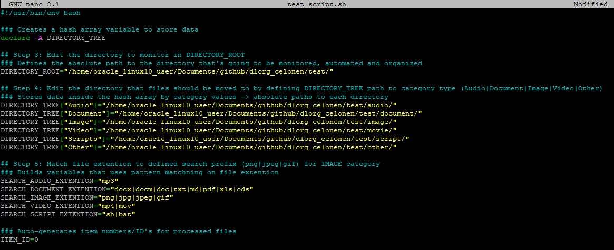
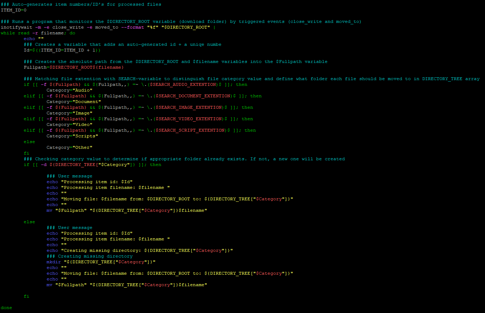
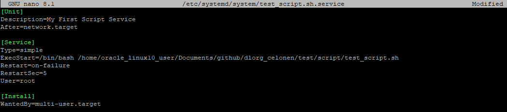
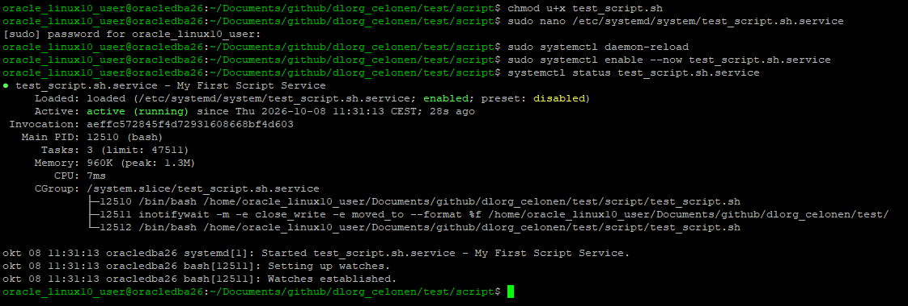

# DLORG_GUIDELINES
How to create a bash script that monitors and organizes files automatically in the Download-directory

## Step 1: Create a bash script and name it <your_bash_script>.sh
Open the terminal and run the following command:

``` 
nano <your_bash_script>.sh
```

## Step 2: Add the following code in the newly created script after [code] to [/code] and save it  

[code]

```
#!/usr/bin/env bash

### Creates a hash array variable to store data
declare -A DIRECTORY_TREE

## Step 3: Edit the directory to monitor in DIRECTORY_ROOT
### Defines the absolute path to the directory that's going to be monitored, automated and organized 
DIRECTORY_ROOT="/home/oracle_linux10_user/Documents/github/dlorg_celonen/test/"

## Step 4: Edit the directory that files should be moved to by defining DIRECTORY_TREE path to category type (Audio | Document | Image | Video | Other)
### Stores data inside the hash array by category values -> absolute paths to each directory  
DIRECTORY_TREE["Audio"]="/home/oracle_linux10_user/Documents/github/dlorg_celonen/test/audio/"
DIRECTORY_TREE["Document"]="/home/oracle_linux10_user/Documents/github/dlorg_celonen/test/document/"
DIRECTORY_TREE["Image"]="/home/oracle_linux10_user/Documents/github/dlorg_celonen/test/image/"
DIRECTORY_TREE["Video"]="/home/oracle_linux10_user/Documents/github/dlorg_celonen/test/video/"
DIRECTORY_TREE["Scripts"]="/home/oracle_linux10_user/Documents/github/dlorg_celonen/test/script/"
DIRECTORY_TREE["Other"]="/home/oracle_linux10_user/Documents/github/dlorg_celonen/test/other/"

## Step 5: Match file extention to defined search prefix (png | jpeg | gif) for IMAGE category
### Builds variables that uses pattern matchning on file extention
SEARCH_AUDIO_EXTENTION="mp3"
SEARCH_DOCUMENT_EXTENTION="docx|docm|doc|txt|md|pdf|xls|ods"
SEARCH_IMAGE_EXTENTION="png|jpg|jpeg|gif"
SEARCH_VIDEO_EXTENTION="mp4|mov"
SEARCH_SCRIPT_EXTENTION="sh|bat"

### Auto-generates item numbers/ID's for processed files
ITEM_ID=0

 

### Runs a program that monitors the $DIRECTORY_ROOT variable (download folder) by triggered events (close_write and moved_to)
inotifywait -m -e close_write -e moved_to --format "%f" "$DIRECTORY_ROOT" |
while read -r filename; do
	echo ""
	### Creates a variable that adds an auto-generated id + a uniqe number 
        Id=$((ITEM_ID=ITEM_ID + 1))

	### Creates the absolute path from the $DIRECTORY_ROOT and $filename variables into the $Fullpath variable
	Fullpath=$DIRECTORY_ROOT${filename}

	### Matching file extention with SEARCH-variable to distinguish file category value and define what folder each file should be moved to in DIRECTORY_TREE array
	if [[ -f ${Fullpath} && ${Fullpath,,} =~ \.($SEARCH_AUDIO_EXTENTION)$ ]]; then
		Category="Audio"
        elif [[ -f ${Fullpath} && ${Fullpath,,} =~ \.($SEARCH_DOCUMENT_EXTENTION)$ ]]; then
		Category="Document"
        elif [[ -f ${Fullpath} && ${Fullpath,,} =~ \.($SEARCH_IMAGE_EXTENTION)$ ]]; then
		Category="Image"
	elif [[ -f ${Fullpath} && ${Fullpath,,} =~ \.($SEARCH_VIDEO_EXTENTION)$ ]]; then
                Category="Video"
	elif [[ -f ${Fullpath} && ${Fullpath,,} =~ \.($SEARCH_SCRIPT_EXTENTION)$ ]]; then
                Category="Scripts"
	else
                Category="Other"
	fi
	### Checking category value to determine if appropriate folder already exists. If not, a new one will be created
	if [[ -d ${DIRECTORY_TREE["$Category"]} ]]; then

		### User message
		echo "Processing item id: $Id"
		echo "Processing item filename: $filename "
		echo ""
		echo "Moving file: $filename from: $DIRECTORY_ROOT to: ${DIRECTORY_TREE["$Category"]}"
		echo ""
		mv "$Fullpath" "${DIRECTORY_TREE["$Category"]}$filename"

	else
		### User message
		echo "Processing item id: $Id"
		echo "Processing item filename: $filename "
		echo ""
		echo "Creating missing directory: ${DIRECTORY_TREE["$Category"]}"
		### Creating missing directory
		mkdir "${DIRECTORY_TREE["$Category"]}"
		echo ""
		echo "Moving file: $filename from: $DIRECTORY_ROOT to: ${DIRECTORY_TREE["$Category"]}"
		echo ""
		mv "$Fullpath" "${DIRECTORY_TREE["$Category"]}$filename"

	fi 

done
```

[/code]

 

## Step 6: Open the terminal, enable permissions and make the bash script executable

```
chmod u+x <your_bash_script>.sh
``` 

## Step 7: Automate the bash script into a service, so it's always running in the background
In the terminal, run the following command and name the service <your_bash_script>.service 	

``` 	
sudo nano /etc/systemd/system/test_script.sh.service
``` 

## Step 8: Insert the following code in the unit-file document, change ExecStart= to bash script path, and save
[Unit]
Description=My First Script Service
After=network.target

[Service]
Type=simple
ExecStart=/bin/bash /home/oracle_linux10_user/Documents/github/dlorg_celonen/test/script/test_script.sh
Restart=on-failure
RestartSec=5
User=root

[Install]
WantedBy=multi-user.target

 

## Step 9: Open the terminal and run the following commands

```
sudo systemctl daemon-reload
sudo systemctl enable --now <your_bash_script>.service 
```

## Step 10: Run the following command to check that the service is active

```
systemctl status <your_bash_script>.service 
```

 
